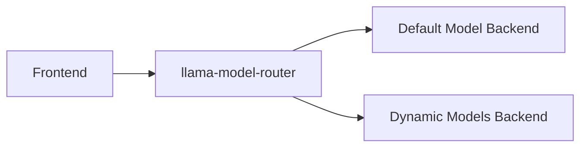

# Llama Model Router

A lightweight Go-based router for rationalising on-prem LLM inference that uses the OpenAI API. It is intended to be
deployed as part of a larger system, alongside components such as [llama-swap](https://github.com/mostlygeek/llama-swap), 
[llama.cpp server](https://github.com/ggml-org/llama.cpp/tree/master/tools/server) and [open webui](https://openwebui.com/),
something like this:



Routing is on the basis of model specified. Any particular model, or group of models, can be configured to route to a 
particular backend endpoint or group of endpoints. This grouping of model(s) and endpoint(s) is called a "pool". The 
intention is to minimise the loading and unloading of model weights.

## Features

* Configurable pools of endpoints for different models
* Sticky sessions per user and model (within a pool)
* Supports `/v1/chat/completions` and `/v1/models` endpoints as per [the OpenAI API](https://openai.com/index/openai-api/)
* Health endpoint `/health`
* Run directly as a binary or in a Docker container

## Getting Started

### Prerequisites

* Go 1.25+
* Docker (optional for container usage)

### Configuration

Create a `pools.yaml` file to define your model pools, for example:

```yaml
pools:
  - name: "default-pool"
    endpoints:
      - "http://localhost:9001"
    models:
      - "llama3-8b-instruct"

  - name: "dynamic-pool"
    endpoints:
      - "http://localhost:9101"
      - "http://localhost:9101"
    models:
      - "*"
```

### Running Locally

```bash
# Build the binary
go build -o router ./cmd/router

# Run with defaults
./router

# Optional flags:
# -config PATH     # path to config file (default: pools.yaml)
# -listen HOST:PORT # host and port to listen on (default: 0.0.0.0:9090)
```

### Running with Docker

```bash
docker build -t llama-model-router:latest .
docker run -p 9090:9090 llama-model-router:latest
```

### Endpoints

* `POST /v1/chat/completions` - proxy chat requests to the appropriate pool
* `GET /v1/models` - aggregates all pool models
* `GET /health` - simple health check

### License

MIT - see [text here](LICENSE.TXT)
